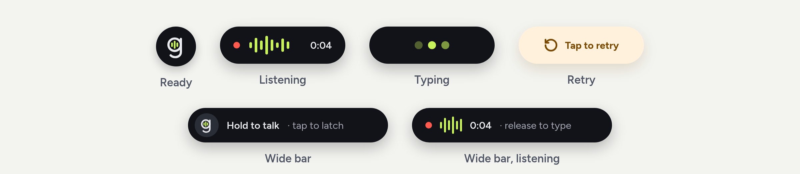

<p align="center"></p>

# gillspeak for Android (experimental)

Dictation for Android: hold the mic, talk, let go, and clean text lands in the focused field. Two ways in:

<p align="center"></p>

- **Floating bubble** (recommended): keep your usual keyboard; a small "G" appears over it whenever you type. Hold it to talk, or tap to start and tap again to finish. While recording it stretches into a red pill with a live waveform and timer. Drag it anywhere, including onto the keyboard; size and shape (square or a wide bar) are set in the app. It uses an accessibility service to see when a keyboard and a text field are on screen and to type into that field; it skips password fields.
- **gillspeak keyboard**: a full-screen mic keyboard, for when you'd rather switch keyboards.

- **Voice commands** from the side button: hold it, say what you want, and gillspeak does it. See [Voice commands](#voice-commands).

- **Local only by default: nothing leaves your phone.** Speech recognition is Parakeet TDT 0.6B v3 on the phone (the desktop model, through sherpa-onnx), followed by the desktop clean-up rules. The ~640 MB model is downloaded once by Android's DownloadManager (Wi-Fi only, resumable) and each file is SHA256-checked. English and 24 other European languages.
- **Optional cloud engines**, chosen in the app: **Gemini** (sends the audio to Google; one request transcribes and cleans with the desktop `clean_v2` prompt; handles Punjabi and mixed languages) and **Groq** (sends the audio to Groq's Whisper, then a text-only clean-up when the gate says it's worth it). The desktop rules, gate and validator are ported to Kotlin; if a cleaned text fails validation, the rules-cleaned transcript is inserted instead.
- Keyboard: ⌨ goes back to your previous keyboard, ↶ removes the last dictation, and a failed request keeps the audio: tap the status line to retry.
- The app screen holds setup, the API key, model, dictionary and the last 30 dictations (kept only on the phone).

Tested on a Galaxy S25 and a Galaxy Z Fold5 (Android 16). Needs Android 11+.

## Install

Download `gillspeak-*.apk` from the [Releases page](https://github.com/hkgill/gillspeak/releases) on your phone, open it and allow installing from your browser or file manager. Released APKs contain no API keys: Local only works without one, and to use Gemini or Groq you paste your own key into the app (free at [Google AI Studio](https://aistudio.google.com/apikey) or [console.groq.com](https://console.groq.com/keys)). Keys stay on the phone.

Then set it up as described at the end of [Build and install](#build-and-install).

## Voice commands

Make gillspeak the phone's digital assistant (in the app, *Voice commands → Side button*, or *Settings → Apps → Choose default apps → Digital assistant app*). Holding the side button then opens a see-through gillspeak screen instead of Gemini: the screen dims, a teal wave runs out of the side button round the edge, and the bubble drops in and listens. It stops when you stop talking (or tap the pill), shows a card saying what it understood, and does it.

| Say | What happens |
| --- | --- |
| "Open Spotify", "launch the camera" | Opens the app whose name is closest (a slight mishearing still matches) |
| "Set a timer for 10 minutes", "half an hour timer" | Starts a timer in the Clock app |
| "Set an alarm for 6:30 am", "wake me up at seven" | Sets an alarm in the Clock app |
| "Turn on the torch", "flashlight off" | The torch |
| "Pause", "resume", "next song", "previous track" | Whatever is playing |
| "Text Sam I'm running late" | Opens Messages to Sam with the text filled in; you tap Send |
| "Call Mum" | Opens the dialler with Mum's number; you tap Call |
| "Navigate to the airport" | Directions in Maps |
| "Add dentist tomorrow at 3 to my calendar", "schedule a meeting with Sam on Friday at 2:30" | Opens your calendar's new-event screen filled in; you tap Save |
| "Search for …", or anything else | Offers a web search, only if you tap it |

- **Only these commands ever run.** The transcript is matched by rules in `Commands.kt` on the phone, whichever engine transcribed it; a model never decides what to do. Texts and calls are never sent or dialled by gillspeak.
- **Texting and calling by name** need the contacts permission; contacts are read on the phone when you ask and never stored.
- Giving gillspeak the assistant role turns off "Hey Google" and Gemini's overlay; the Gemini app still opens from its icon.
- The words appear after you stop talking: none of the engines stream.
- The wave starts 40% of the way down the right edge, where the side button is on Galaxy S-series phones.

## Build and install

Needs the Android SDK (platform 36) and a JDK 17–21. Android Studio's bundled JBR works; JDK 25 is too new for the Android Gradle plugin.

```bash
cd android
echo "sdk.dir=$HOME/Android/Sdk" > local.properties
JAVA_HOME=/path/to/jdk21 ./gradlew testDebugUnitTest assembleDebug
adb install -r app/build/outputs/apk/debug/app-debug.apk
```

`local.properties` is git-ignored. No API key is ever built into the app; paste yours into the app's settings.

Wireless debugging (Android 11+): Developer options → Wireless debugging → Pair device with pairing code, then `adb pair IP:PAIRPORT CODE` and `adb connect IP:PORT` (the port on the main Wireless debugging screen).

Then open the app and allow the microphone. For the bubble, turn on **gillspeak bubble** under Settings → Accessibility → Installed apps (apps installed from a file rather than adb may first need *App info → ⋮ → Allow restricted settings*). For the keyboard, turn on **gillspeak keyboard** in keyboard settings and switch to it. On Samsung phones, *Settings → General management → Keyboard list and default → Keyboard button on navigation bar* makes switching quicker.

### Release a signed APK

Release builds are signed with a keystore that never goes in the repo. Create it once and back it up: without it you can't publish an update that installs over an earlier release.

```bash
keytool -genkeypair -v -keystore ~/.android/gillspeak-release.jks -alias gillspeak \
  -keyalg RSA -keysize 4096 -validity 10000
```

Add the signing settings to `local.properties`:

```properties
release.storeFile=/home/YOU/.android/gillspeak-release.jks
release.storePassword=...
release.keyAlias=gillspeak
release.keyPassword=...
```

Raise `versionCode` and `versionName` in `app/build.gradle.kts`, then build and attach the APK to a GitHub release (never commit it):

```bash
JAVA_HOME=/path/to/jdk21 ./gradlew testDebugUnitTest assembleRelease
cp app/build/outputs/apk/release/app-release.apk /tmp/gillspeak-0.1.0.apk
gh release create android-v0.1.0 /tmp/gillspeak-0.1.0.apk --prerelease --title "Android 0.1.0 (experimental)"
```

Without the `release.*` settings, `assembleRelease` produces an unsigned `app-release-unsigned.apk` that Android won't install.

## Develop

- `app/src/main/assets/clean_v2.txt` is a copy of `gillspeak/prompts/clean_v2.txt`; `PromptSyncTest` fails if they drift. `audio_preface.txt` adds the audio-specific instructions (return a verbatim `transcript` and a cleaned `text` as JSON).
- `RulesTest` holds cases copied from `tests/test_rules.py` and `tests/test_validate.py`. Android's regex engine is ICU, not the JVM's: don't use `(?U)` (ICU rejects it at load time, which JVM tests won't catch).
- `MicController` is the mic state machine (hold, latch, retry) shared by the keyboard and the bubble. The bubble waits 150 ms before starting the mic so a drag never starts a recording, and refuses to send all-silent audio (what Android returns when it blocks background recording).
- Logs: `adb logcat -s gillspeak` shows why the bubble is or isn't shown, where each Gemini request spent its time (upload, wait, thinking tokens), and how text was inserted.
- Debug builds have test hooks, reachable from adb only (a debug-only receiver that requires `DUMP`):

  ```bash
  adb push clip.wav /data/local/tmp/t.wav
  adb shell run-as dev.hkgill.gillspeak sh -c 'mkdir -p files && cp /data/local/tmp/t.wav files/t.wav'
  adb shell am broadcast -n dev.hkgill.gillspeak/.DebugReceiver --es selftest t.wav   # optional: --es engine local|groq|gemini
  adb shell am broadcast -n dev.hkgill.gillspeak/.DebugReceiver --ez download_model true
  adb logcat -s gillspeak
  ```
